# -Internship-Guide-
This guide contains all needed knowledge to simplify internship process

# [Main topics:](#main-topics)
* [Git Workflow](#git-workflow)
* [Board Workflow](#board-workflow)
* [Code Standards](#code-standards)
* [Jira](#jira)

## [Git workflow](#git-workflow)
У системы контроля версий(Git) две основных задачи:
1. Хранить информацию о всех изменениях в вашем коде, начиная с самой первой строчки
2. Обеспечение удобства командной работы над кодом.

Репозиторий Git — это место, где хранится ваш код и вся информация о его изменениях.
Репозитории могут находиться у вас на компьютере, на компьютерах ваших коллег и на удалённом сервере.

Обычно работа с Git выглядит так:

1. Сверстали шапку сайта — сделали commit;
2. Сверстали контент страницы — сделали второй commit;
3. Закончили верстать страницу — сделали третий commit и отправили код на сервер, чтобы вашу работу могли увидеть коллеги, либо чтобы опубликовать страницу;

Формат commit massage должен быть следующим ```<WorkItem number>: <короткое описание>```

Пример: ```US001: Created ComponentFactory Class```

Базовый GitFlow на большинстве проектов представлен двумя основными ветками (master и develop) и работой с ними:
* Ветка master зачастую используется для создания релизов, хранения истории о релизах и публикации их на сервере;
* Ветка develop необходима непосредственно для разработки и хранения истории работы над проектом;

Для разработки определенной фичи/фикса бага используют отдельные ветки, которые создаются на основе develop ветки.
Чтобы создать feature ветку необходимо:
1. Перейти на develop ветку
2. Создать новую ветку соблюдая правила нейминга

Формат именования feature/bugfix веток: ```feature/<workitem number>-<workitem description>```

Пример: ```feature/US001-create-component-factory``` или ```bugfix/DE001-fix-incorect-behavior```

После окончания работы в feature ветке необходимо создать Pull Request(далее PR) в Git репозиторие для дальнейшего код ревью

После код ревью и фикса всех коментариев необходимо завершить PR, после чего ваша feature ветка автоматически вмерджится в develop ветку.

При успешном мердже в develop вам необходимо будет актуализировать все остальные feature ветки, в которых ведутся работы(Если таковые имеются)

Для этого необходимо:
1. Перейти на ветку develop 
2. Обновить ветку после завершения PRа
3. Перейти на вашу feature ветку
4. Вмерджить изменения из develop ветки
5. После этого для обновления всех остальных веток необходимо повторить шаги 3 и 4 до последующего обновления develop

### Гайды по операциям с Git с помощью git bash/терминала

#### Чтобы перейти на существующую ветку необходимо:
1. Открыть терминал/git bash в корне проекта
2. Написать команду ```git checkout <имя ветки>```

#### Чтобы создать ветку в git необходимо:
1. Открыть терминал/git bash в корне проекта
2. Написать команду ```git checkout -b <имя ветки>```

#### Чтобы обновить ветку до последнего состояния необходимо:
1. Перейти в необходимую для обновления ветку
2. Выполнить команду ```git pull```

#### Для слияния одной ветки с другой необходимо:
1. Перейти в ветку, в которую вы хотите выполнить слияние
2. Выполнить команду ```git merge <имя ветки, которую необходимо вмерджить>```

### Гайды по операциям с Git с помощью Webstorm IDE

#### Чтобы перейти на существующую ветку необходимо:
> 1. 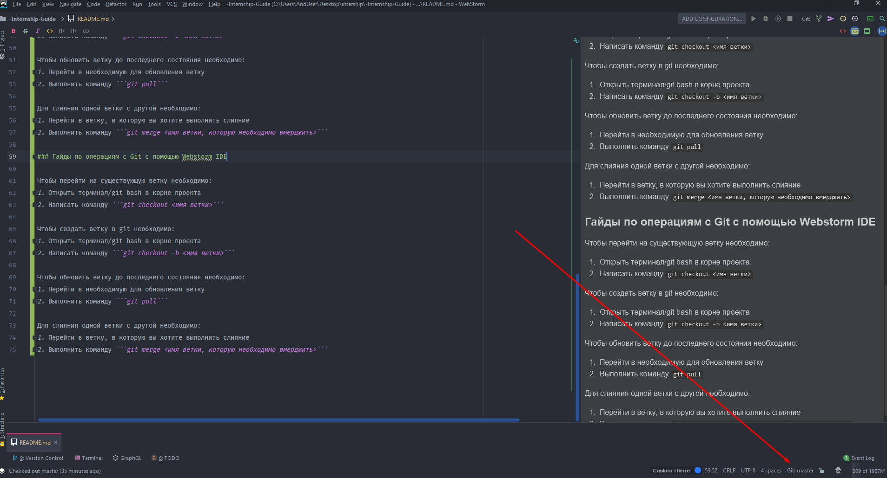
Кликнуть имя текущей ветки в нижнем правом углу
> 2. 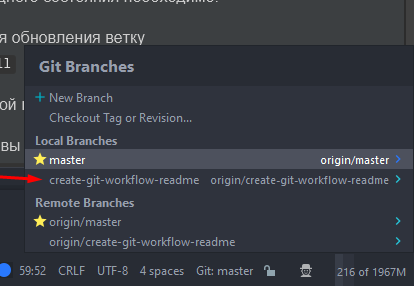
В открытом окне выбрать из списка необходимую ветку и кликнуть по ней
> 3. 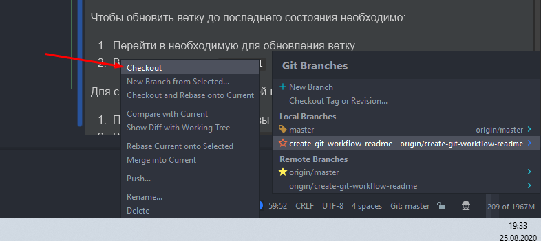
В новом сеню нажать на Checkout
> 4. После этого имя текущей ветки отобразится в нижнем правом углу

#### Чтобы создать ветку в git необходимо:
> 1. 
> Кликнуть имя текущей ветки в нижнем правом углу
> 2. 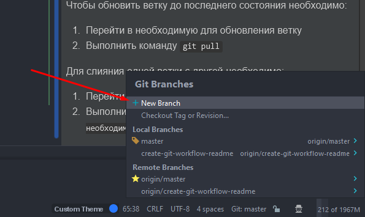
> В открытом меню кликнуть на пункт New Branch
> 3. 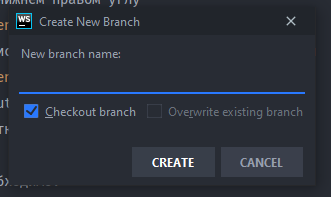
> В модальном окне в поле New branch name задать имя ветки и кликнуть на кнопку Create.
> Если необходимости переходить на новую ветку сейчас нет то нужно убрать чекбокс Checkout branch
> 4. После этого имя новой ветки отобразится в нижнем углу, если чекбокс перехода был активен. В противном случае ветку можно найти в списке всех веток.


#### Чтобы обновить ветку до последнего состояния необходимо:
> 1. 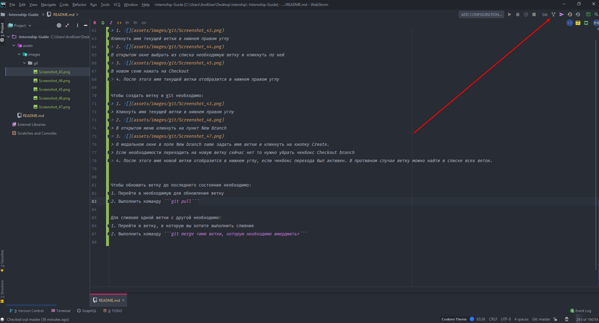
Кликнуть на кнопку Update Project в верхнем правом углу
> 2. 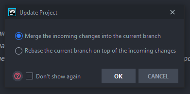
В модальном окне нажать Ok

Или

> 1. 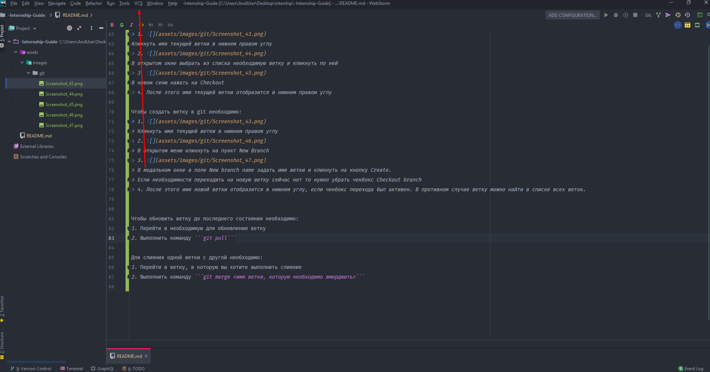
>   В верхнем меню кликнуть на VCS
> 2. 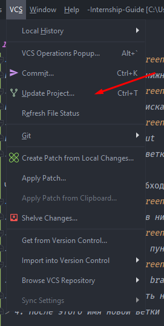
> Кликнуть на Update project
> 3. 
> В модальном окне нажать Ok

#### Для слияния одной ветки с другой необходимо:
> 1. Перейти в ветку, в которую вы хотите выполнить слияние
> 2. 
>  Кликнуть имя текущей ветки в нижнем правом углу
> 3. 
> В открытом окне выбрать из списка необходимую ветку и кликнуть по ней
> 4. 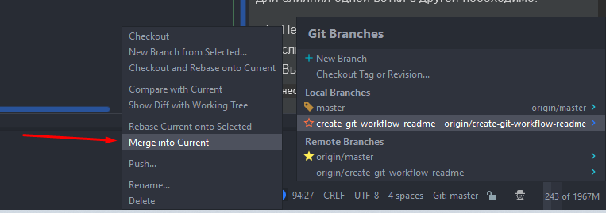
> В открытом меню кликнуть на пункт Merge into current

#### Для того чтобы выполнить коммит необходимо:
> 1. 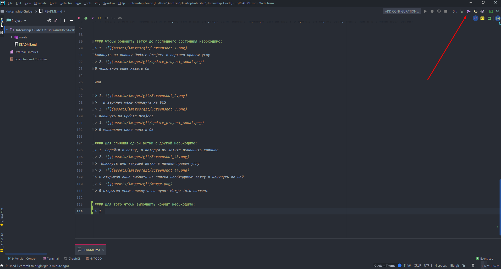
>  Кликнуть на кнопку Commit в верхнем правом углу
> 2. 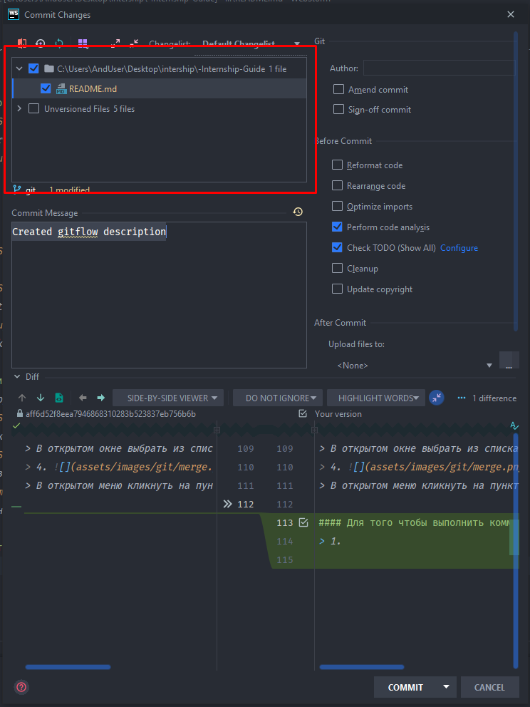
> В выделеном поле выбрать файлы, которые хотите закомитить
> 3. 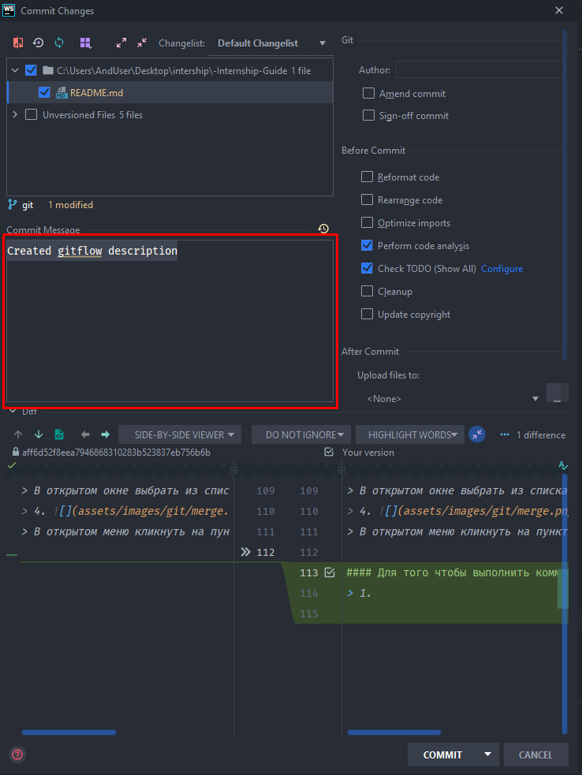
> В следующем после написать Commit message
> 4. Нажать на кнопку Commit
> 5. Если необходимо сразу запушить изменения можно кликнуть на стрелочку рядом с кнопкой Commit
> 6. 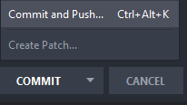
> В открывшемся меню кликнуть на Commit and Push...
> 7. 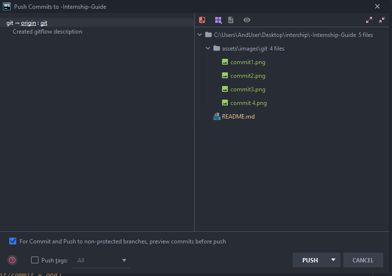
> В новом модальном окне кликнуть Push

#### Для того чтобы выполнить пуш необходимо:
> 1. 
>   В верхнем меню кликнуть на VCS
> 2. 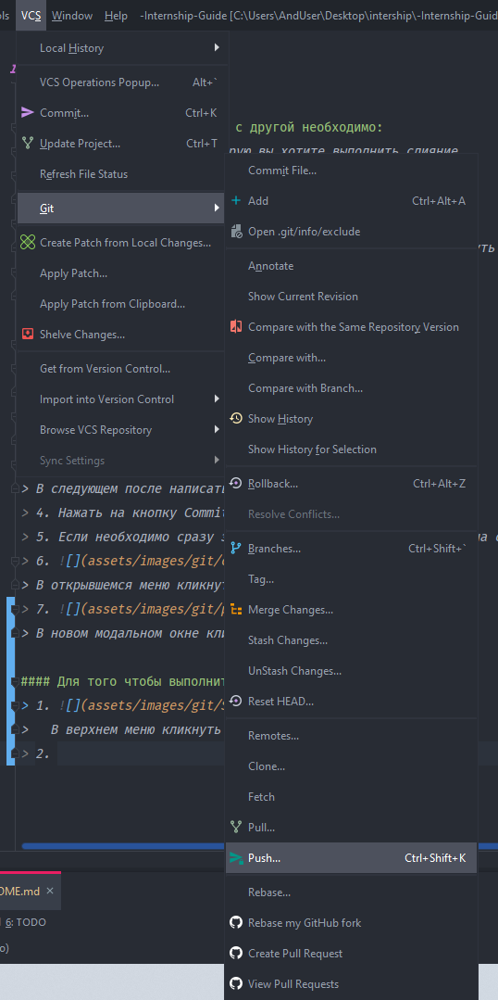
> В выпадающем меню выбрать git, а затем нажать на Push
> 3. 
> В новом модальном окне кликнуть Push

[Return to the main topics list](#main-topics)

## [Board Workflow](#board-workflow)

В настоящем проекте вы скорее всего столкнетесь с таким явлением как борда с тасками.
Она нужна для удобного отслежвания над какой задачей ведется работа. По ходу нашей стажировки
вы получите ссылку с вашей личной бордой и описанными на ней тасками. Данный раздел предназначен для
того чтобы дать понимание необходмых терминологий и процессов которые упростят работу с бордой.

На вашей борде представлены 4 состояния для Ворк Айтемов [Ворк Айтем = Карточка на Борде]:

> 
>* __Defined__  - это состояние в котором находятся все тиикеты изначально, существует для хранения всех существующих задач
>* __In Progress__ - сюда переводится тикет во время работы над ним
>* __Dev Complete__ - тикет переводится в это состояние после того как работа над задачей закончена и создан __PR__.
>* __Accepted__ - после того как PR был заапрувлен и ветка была вмержена

Хотя на реальных проекта куда больше видов Ворк Айтемов, мы будем использовать только 2:

> US (обозначает User Story) - описывает какое поведение ождается увидеть когда эта задача будет выполнена
> 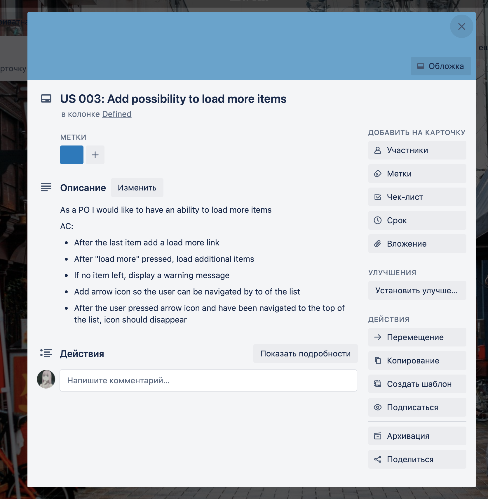
>
>AC (Acceptance Criteria) - описывает что должно быть выполнено

Второй тип Ворк Айтемов с которыми вам придется работать называется Defect:
> DE - дефект. Создается когда в функционале был найден баг либо что-то работает не так как ожидалось.
> 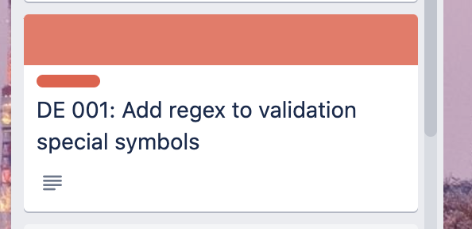
>
>В дефекте описывается: 
> 1. AR (Actual Result) - описывает поведение которое имеется на данный момент
> 2. ER (Expected Result) - описывает поведение которые должно быть
>
>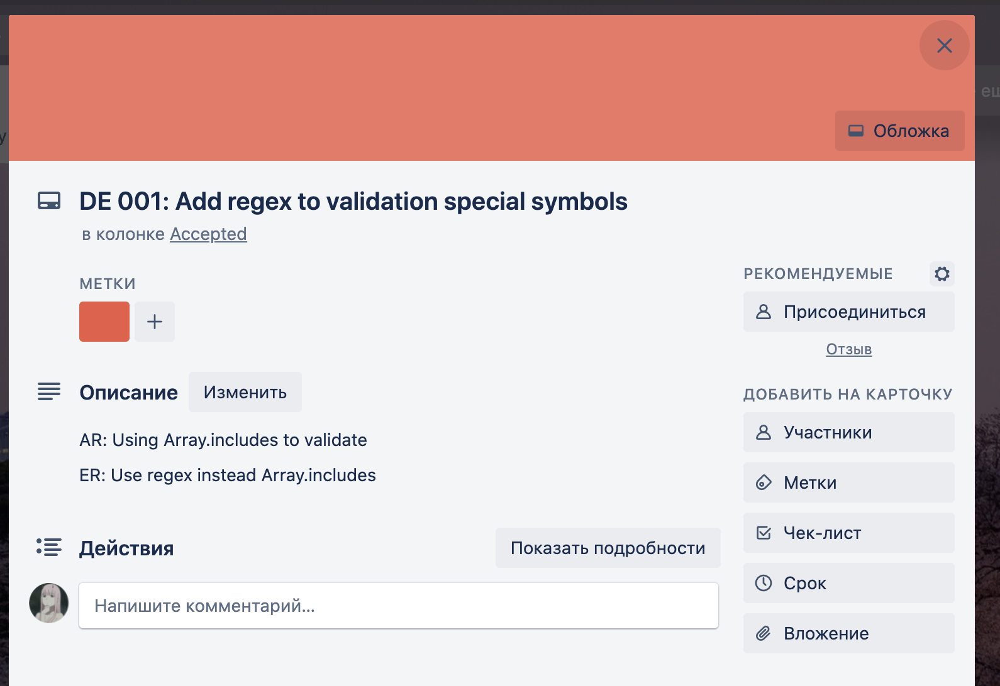
>
Каждый раз после ревью вашего приложения с точки зрения функционала, вам необходимо будет создать новый дефект:

> 1. Нажимаем на иконку справа от создать карточку
>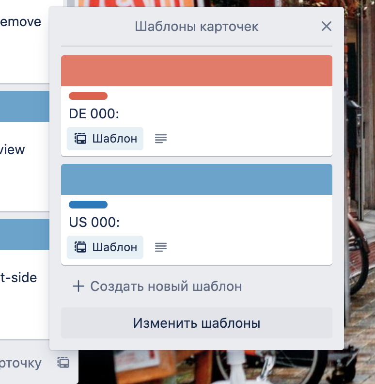
> 2. Из появившихся шаблонов создаем карточку с дефектом, нажимаем создать карточку
>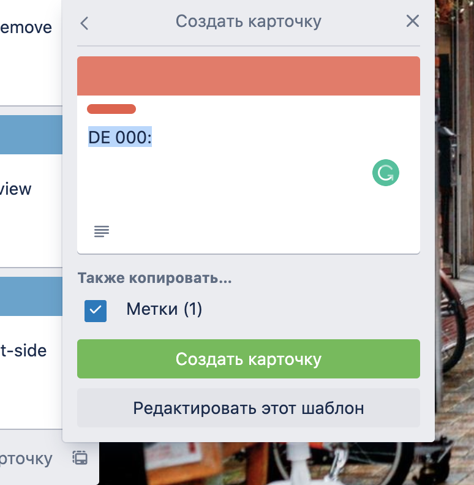
> 3. В карточке указываем AR & ER, а так же заполняем номер карточки и короткое описание 
> 
>Пример: ```DE 000: Short defect description```
>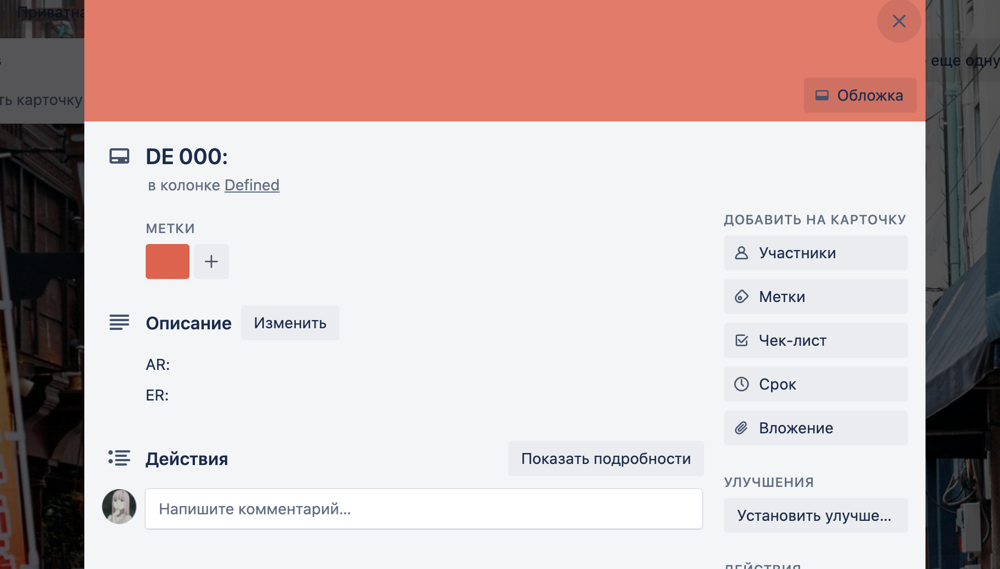

Ниже приведен полный алгоритм действий который должны быть выполнены с началом работы над Ворк Айтемом

> Внимательно прочитать описание стори 
> 
>
>
>Далее необходимо разбить задачу по пунктам на более мелкие: нажимаем на кнопку Чек-Лист и 
>указываем название листа тасок (Рекомендуется называть Tasks)
>
>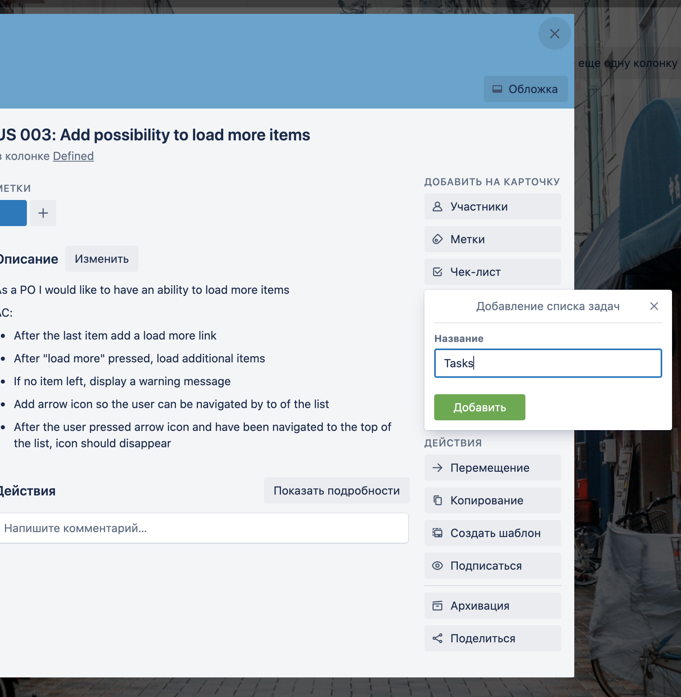
>
>После создания листа тасок, необходимо создать сами таски 
>
>
>
>Следующм шагом нужно оценить примерные затраты времени
>
>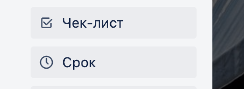
>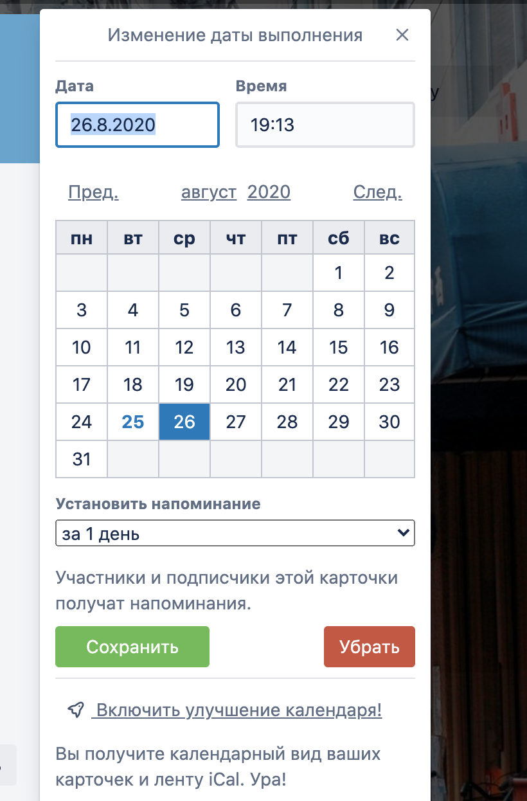
>
>После этого можно мувать ворк айтем в колонку __In Progress__
>
>Как только работа над айтемом окончена и соответствующий Пулл Реквест создан, карточку следует
>переместить в состояние __Dev Complete__
>
>После успешного Код Ревью, и заапрувленого Пулл Реквеста, карточку следует перевести в состояние
>__Accepted__

[Return to the main topics list](#main-topics)

## [Code Standards](#code-standards)

### Навигация по теме:
- [Переменные](#переменные)
- [Функции](#функции)
- [Условные операторы](#conditions)
   
Ниже будет представлен перечень пунктов которые помогут подготовить код к ревью, 
чтобы он соответствовал необходимым стандартам.

#### [Переменные](#variables)
>
    Любая переменная должна иметь понятное название, по которому можно судить
    о ее предназначении. Бессмысленных и неочевидных переменных стоит избегать.
    Имя переменной должно характеризировать проблему реального мира, 
    а не ее решение на языке программирования. 
    Проще всего словами проговорить описываемую переменной сущность 
    и назвать переменную соответствующими словами
>
    В именах переменных следует использовать спецификаторы Count и Index вместо Num. 
    Это логично, так как они четко отражают назначение переменной (количество и номер), 
    а вот Num выглядит достаточно двусмысленно и может в некоторых случаях ввести в заблуждение
>    
    При именовании констант следует использовать не конкретные числа, 
    а абстрактные сущности, о которых идет речь. 
    Это боле понятно с точки зрения читабельности кода 
    и является хорошим стилем программирования.
    
 Примеры хороших имен переменных:
 > employeesCount, userMonthWorkDaysCount, yearTax, maxComputedSalary


Примеры плохих имен переменных:
> x, $fb, f_ar_type_data, f_obj_result, inputData, returnValue, resultArray, obj1, obj2

Использование констант: 
>Если у вас есть специальные значения в вашем коде, такие как числа или строки, используйте вместо них константы. 
>Даже если это кажется очевидным сейчас, через месяц или два никто не вспомнит, почему было использовано конкретно это число:

Пример: 

    export const ENTER_KEY = 13;
    export const VALIDATION_MESSAGE = 'Please, use only string and number symbols';
    export const OVERFLOW_HIDDEN = 'overflow--hidden';
    export const INVISIBLE = 'display--none';
    
Объявление переменных нужно отделять пустой строкой

Пример:
        
        function TextFunction() {
            const exapmleVariable = 'example'
            
            ...
        }
        
        
        function TextFunction2() {
            const 
                exapmleVariable = 'example',
                exapmleVariable2 = 'example2',
                exapmleVariable3 = 'example3'
                    
            ...
        }
        
Замена выражения переменной: 
>Замена чего-либо с помощью переменной похоже на перенос кода в функцию, 
>только вместо функции мы просто используем переменную.

    if (!el.offsetWidth || !el.offsetHeight) {
        ...
    }
>Вместо выделения функции мы можем сделать его яснее за счет добавления переменной:

    const isVisible = el.offsetWidth && el.offsetHeight;
    
    if (!isVisible) {
        ...
    }

Наиболее часто этот метод применяется с математическими выражениями:
    
    return a * b + (c / d);
>Мы можем сделать яснее этот пример за счет разделения вычислений:

    const 
        multiplier = a * b,
        divisor = c / d;
    
    return multiplier + divisor;

#### [Функции](#functions)

Когда нам стоит выносить код в функции:

1) Перенос кода в функцию
    >мы берем существующий код и переносим его в новую функцию: мы “выделяем” код в новую функцию.

        const width = (value - 0.5) * 16;
    >
        const width = emToPixels(value);
    
        function emToPixels(ems) {
            return (ems - 0.5) * 16;
        }

    >Единственное изменение состоит в том, что вычисления выведены в отдельную функцию. 
    Название функции описывает то, что она делает и этот код не нуждается в дальнейших уточнениях. В
    качестве дополнительного бонуса мы получаем полезную функцию-хелпер, 
    которую вы можете использовать где угодно, то есть этот метод также позволяет избежать дублирования.

2) Замена условного выражения функцией
    >Условия с несколькими операндами сложно понять без комментариев. 
    Мы можем применить к ним схожий метод для того, чтобы они были понятнее:
        
        if(!el.offsetWidth || !el.offsetHeight) {
            ...
        }
    >
        function isVisible(el) {
             return el.offsetWidth && el.offsetHeight;
        }
         
        if(!isVisible(el)) {
            ...
        }

3) Замена дублируемого кода
    >Если при просмотре своего кода вы встречаете блоки кода повторяющиеся два и более раз,
    следует выносить их в функции:

        const
            creationDate = this.getDate(Date.now()).split('.').reverse().join('-'),
            deadLine = this.getDate(Date.now()).split('.').reverse().join('-')
    >Как мы видим у нас есть цепочка повторяющихся действий, в таком случае лучше будет 
    вынести дублируемы код в отдельный метод
        
        const
            creationDate = getFormattedDate(),
            deadLine = getFormattedDate(true)
            
        function getFormattedDate(isDeadline) {
            const date = isDeadline ? this.getDate(Date.now(), true) : this.getDate(Date.now())
            
            return date.split('.').reverse().join('-')
        }
    > Или возьмем в пример создание похожих объектов
    
        function editCurrentUser(someData) {
            const user = {
                id: someData.id
                name: someData.userName
                title: someData.jobTitle
                role: someData.useRole
            }
            
            ...
        }
        
        function setNewUser() {
            const user = {
                id: generateId()
                name: getUserName()
                title: getUserJobTitle()
                role: getUserRole()
            }
            
            ...
        }
    >Как мы видим у нас создаются два похожих объекта одной формы, но при этом в разных функцях, верным решением в данном 
    случае будет создать функцию которая будет возвращатьнам объект необходмой нам формы                                                                                                                                                                                                                                                                                                                                                                                                                                                                                                                                                                                                                                                                                                                                                                                                                                                                                                                                                                                                                                                                                                                                                                                                                                                                                                                                                                                                                                                                
        
        function createUser(someData = {}) {
            const { id, userName, jobTitle, userRole } = someData 
          
            return {
                id: id || generateId()
                name: userName || getUserName()
                 title: jobTitle || getUserJobTitle()
                 role: userRole || getUserRole()
            }
        }
        
        function setNewUser() {
            const user = createUser()
            
            ...
        }
        
        function editCurrentUser(someData) {
            const user = createUser(someData)
                        
            ...
        }
        
#### [Условные операторы](#conditions)

https://learn.javascript.ru/coding-style
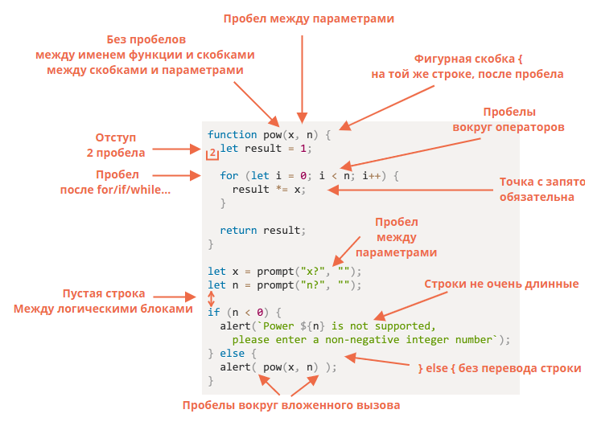


## Jira

Стажеры должны логировать время каждый день.
При логировании времени стажер должен подробно описать проделанную за день работу.
Логирование времени ведется на английском языке.

>Для логирования времени стажеру следует:
>1. Нажать «More», затем «Log work as user»:
>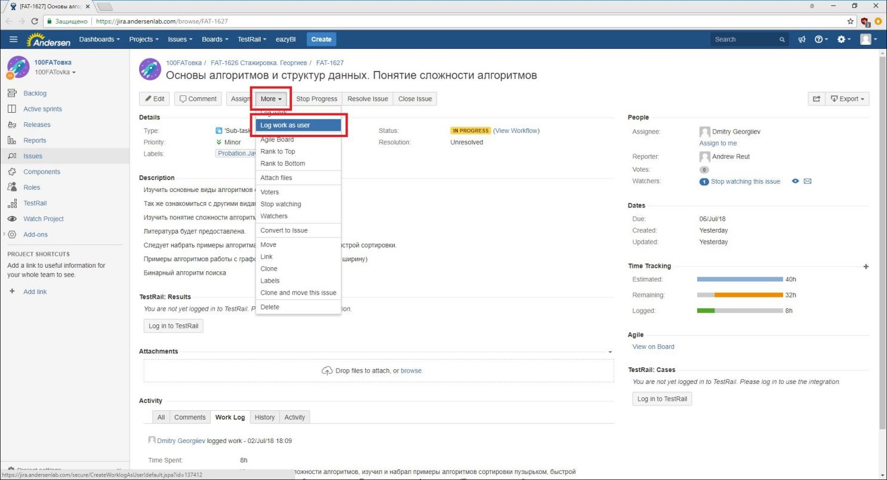
>2. Заполнить форму учёта отработанного времени.
>   1.	Внести количество отработанных часов в поле «Time Spent»;
>   2.	выбрать дату в поле «Date Started»;
>   3.	внести подробное описание проделанной работы в поле «Work Description»;
>   4.	нажать кнопку «Log».


Пример формы учёта отработанного времени:
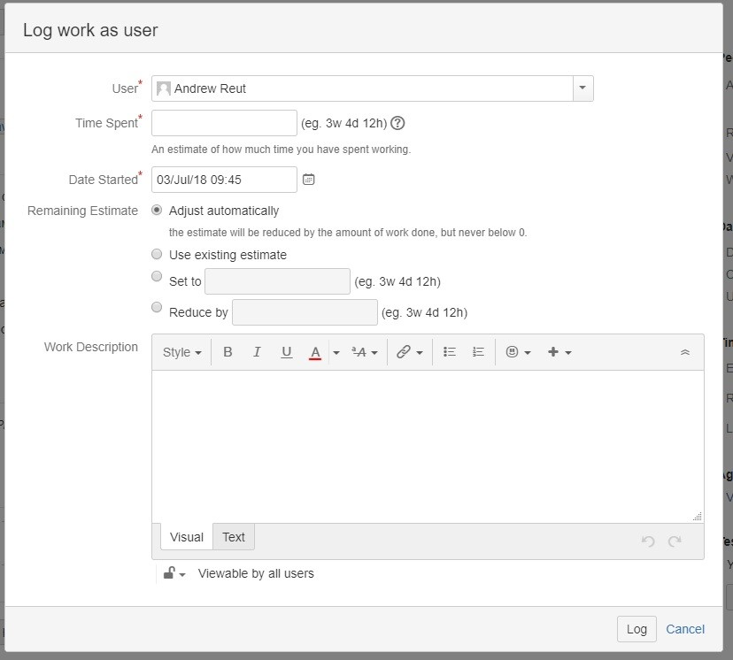
